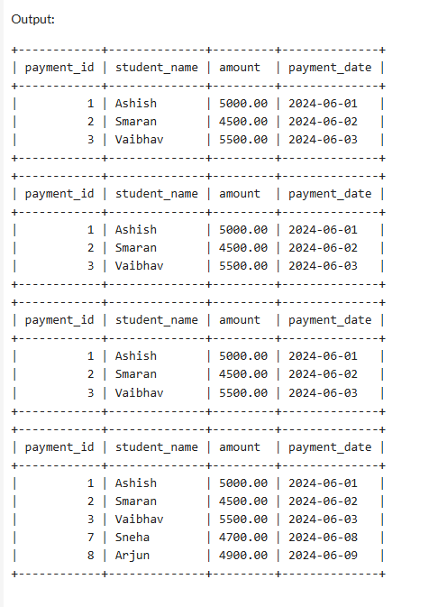

# FeePayments_Transaction-ACID
SQL scripts demonstrating ACID properties (Atomicity, Consistency, Isolation, Durability) using transactions on a FeePayments table. Includes examples of COMMIT, ROLLBACK, and failure handling.

## 📊 Final Output  

Below is the final state of the `FeePayments` table after all parts:  

